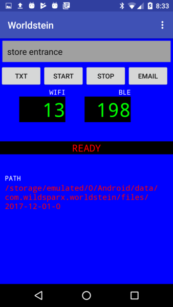

# worldstein
* Acquire and record BLE and WiFi signals with a smart phone.
* Transfer the files to a computer for analysis

Sometimes you want to record the signals in an area or along a path in order to build
a model for locating the user. This app lets you make those recordings.


## Controls
* Text box and `TXT` button for entering notes
* `START` and `STOP` buttons to control recording
* `EMAIL` button emails recording - or you can transfer it with adb.
* `PATH` shows which path to `pull` with adb.

## General
Worldstein creates a new file each time it's launched. The filename is based
on the current date. You can put multiple measurements in one file, marking
them with text notes.

## Format of Recording
* Each line is a JSON object
* Each line has a type field and an epoch-ms timestamp `ts`.

Example:
```
{"type":"wifi","scan_results":[{"ssid":"HOME-XXAE-5","bssid":"ec:aa:88:5d:c2:10","level":-65},{"ssid":"","bssid":"f6:aa:88:5d:c2:10","level":-66},{"ssid":"HOME-XXAE-2.4","bssid":"ec:aa:88:5d:c2:08","level":-58}],"ts":1512070758522}
{"type":"ble","rssi":-75,"bin":"02011b0bff4c000906030bc0a8019","mac":"05:44:88:AC:43:FF","ts":1512070791498}
{"type":"ble","rssi":-76,"bin":"02011a0aff4c0010050110a0733","mac":"04:4B:88:9A:22:4A","ts":1512070791619}

```

## Recording
* Use `START` and `STOP` buttons to control recording
* To record a text note, enter it in the top box and press `TXT`

## Getting Data Off Phone
The current data path is shown on the screen. You can copy the file
to a computer:
* Connect the phone via USB
* `adb pull /storage/emulated/0/Android/data/com.wildsparx.worldstein/files/2017-12-01-0`

Or `EMAIL` it.

## Building
* In `Makefile`, set `JAVA_HOME`
* In `local.properties` set `sdk.dir`
* Connect an Android device
* Type `make bl` to build and install

## Hacking
* main: app/src/main/java/com/example/asher/worldstein/MainActivity.java
* layout: app/src/main/res/layout/content_main.xml
* colors: app/src/main/res/values/colors.xml
* minSdkVersion - the one in Manifest doesn't work, the one in gradle does. grep -r
